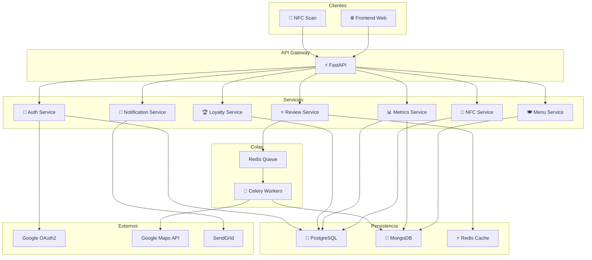
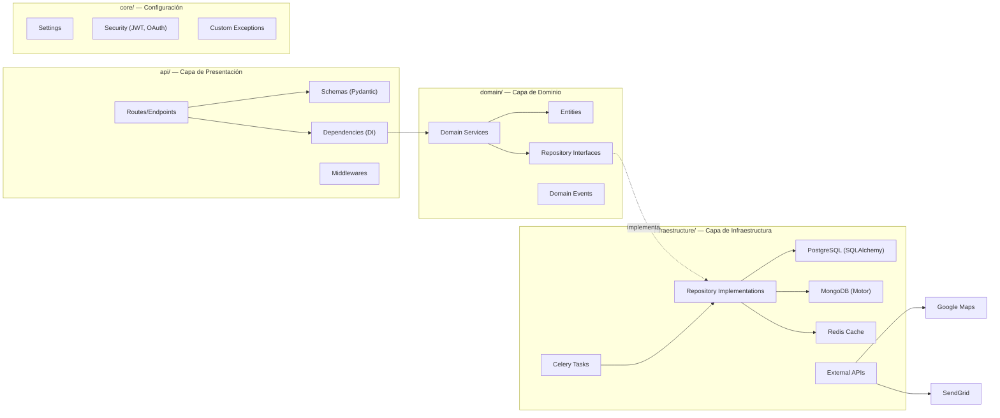
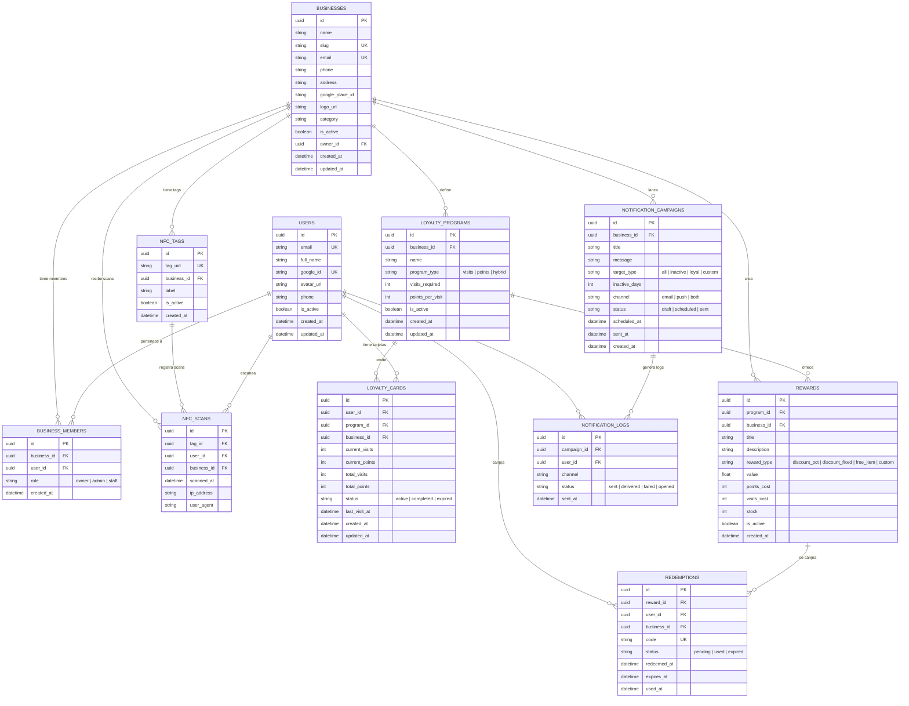
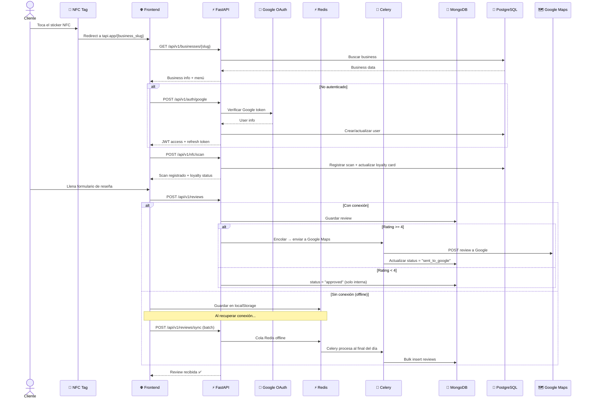
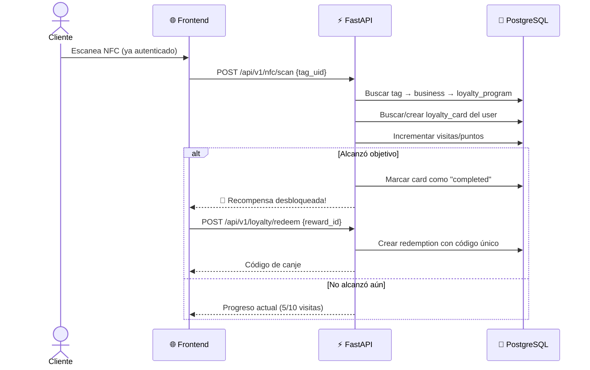
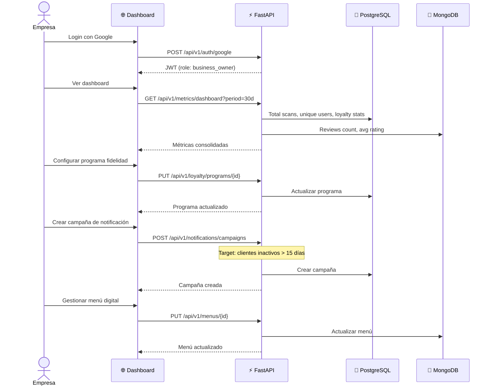
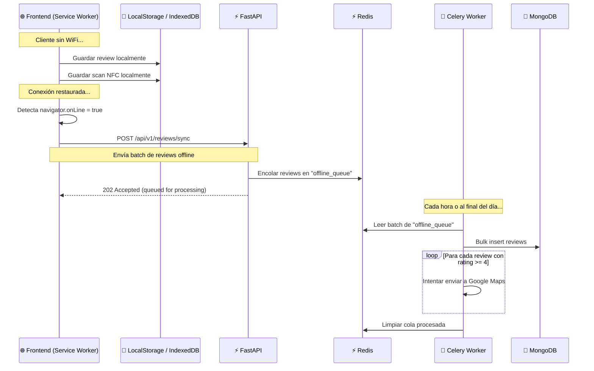

# 🚀 TAPI Backend — MVP Implementation Plan

## Descripción del Proyecto

**TAPI** es una startup que proporciona stickers NFC a tiendas/locales, ofreciendo un sistema integral de fidelización, reseñas, y métricas. Los clientes escanean el NFC al visitar la tienda y acceden a un ecosistema de recompensas y feedback.

**Arquitectura**: API-First para desacoplar frontend (tu hermano) y backend (tú).

**Stack tecnológico seleccionado**:
| Componente | Tecnología |
|---|---|
| Framework | FastAPI (Python 3.11+) |
| SQL DB | PostgreSQL |
| NoSQL DB | MongoDB |
| Cache + Broker | Redis |
| Cola de tareas | Celery + Redis |
| Email | SendGrid |
| Auth | OAuth2 Google + JWT |
| Infra local | Docker Compose |
| Deploy | Railway |

---

## Arquitectura del Sistema

### Diagrama de Alto Nivel



### Arquitectura Clean Architecture (Capas)



---

## Estructura de Directorios Detallada

```
tapi-back/
├── main.py                          # Entry point FastAPI
├── requirements.txt                 # Dependencias Python
├── .env                             # Variables de entorno
├── .env.example                     # Template de variables
├── .gitignore
├── docker-compose.yml               # PostgreSQL, MongoDB, Redis
├── Dockerfile                       # Para deploy
├── alembic.ini                      # Config migraciones SQL
├── alembic/                         # Migraciones PostgreSQL
│   ├── env.py
│   └── versions/
│
├── api/                             # 🎯 Capa de Presentación
│   ├── __init__.py
│   ├── router.py                    # Router principal (agrupa todos)
│   ├── dependencies.py              # Inyección de dependencias
│   ├── middlewares/
│   │   ├── __init__.py
│   │   ├── cors.py                  # CORS config
│   │   └── rate_limiter.py          # Rate limiting
│   ├── v1/                          # Versionado de API
│   │   ├── __init__.py
│   │   ├── auth/
│   │   │   ├── __init__.py
│   │   │   ├── router.py            # POST /auth/google, POST /auth/refresh
│   │   │   └── schemas.py           # GoogleAuthRequest, TokenResponse
│   │   ├── businesses/
│   │   │   ├── __init__.py
│   │   │   ├── router.py            # CRUD empresas
│   │   │   └── schemas.py
│   │   ├── reviews/
│   │   │   ├── __init__.py
│   │   │   ├── router.py            # POST /reviews, GET /reviews
│   │   │   └── schemas.py
│   │   ├── loyalty/
│   │   │   ├── __init__.py
│   │   │   ├── router.py            # Puntos, recompensas, canjeos
│   │   │   └── schemas.py
│   │   ├── notifications/
│   │   │   ├── __init__.py
│   │   │   ├── router.py            # Envío de promociones
│   │   │   └── schemas.py
│   │   ├── metrics/
│   │   │   ├── __init__.py
│   │   │   ├── router.py            # Dashboard data
│   │   │   └── schemas.py
│   │   ├── menus/
│   │   │   ├── __init__.py
│   │   │   ├── router.py            # CRUD menú digital
│   │   │   └── schemas.py
│   │   └── nfc/
│   │       ├── __init__.py
│   │       ├── router.py            # Registro de scans NFC
│   │       └── schemas.py
│
├── core/                            # ⚙️ Configuración y Seguridad
│   ├── __init__.py
│   ├── config.py                    # Settings (pydantic-settings)
│   ├── security.py                  # JWT encode/decode, OAuth helpers
│   ├── exceptions.py                # Excepciones personalizadas
│   └── constants.py                 # Constantes globales
│
├── domain/                          # 🧠 Capa de Dominio (Negocio)
│   ├── __init__.py
│   ├── entities/
│   │   ├── __init__.py
│   │   ├── user.py                  # User entity
│   │   ├── business.py              # Business entity
│   │   ├── review.py                # Review entity
│   │   ├── loyalty.py               # LoyaltyProgram, LoyaltyCard
│   │   ├── reward.py                # Reward, Redemption
│   │   ├── notification.py          # Notification entity
│   │   ├── menu.py                  # Menu, MenuItem
│   │   └── nfc_scan.py              # NfcScan entity
│   ├── repositories/                # Interfaces (Abstract)
│   │   ├── __init__.py
│   │   ├── user_repository.py
│   │   ├── business_repository.py
│   │   ├── review_repository.py
│   │   ├── loyalty_repository.py
│   │   ├── notification_repository.py
│   │   ├── menu_repository.py
│   │   └── nfc_repository.py
│   └── services/                    # Lógica de negocio
│       ├── __init__.py
│       ├── auth_service.py
│       ├── review_service.py
│       ├── loyalty_service.py
│       ├── notification_service.py
│       ├── metrics_service.py
│       └── nfc_service.py
│
├── infraestructure/                 # 🏗️ Capa de Infraestructura
│   ├── __init__.py
│   ├── database/
│   │   ├── __init__.py
│   │   ├── postgres/
│   │   │   ├── __init__.py
│   │   │   ├── connection.py        # SQLAlchemy async engine
│   │   │   ├── models.py            # ORM models (tablas)
│   │   │   └── repositories/
│   │   │       ├── __init__.py
│   │   │       ├── user_repo.py
│   │   │       ├── business_repo.py
│   │   │       ├── loyalty_repo.py
│   │   │       └── nfc_repo.py
│   │   └── mongodb/
│   │       ├── __init__.py
│   │       ├── connection.py        # Motor async client
│   │       ├── collections.py       # Collection schemas
│   │       └── repositories/
│   │           ├── __init__.py
│   │           ├── review_repo.py
│   │           └── menu_repo.py
│   ├── cache/
│   │   ├── __init__.py
│   │   └── redis_cache.py           # Redis cache + offline queue
│   ├── queue/
│   │   ├── __init__.py
│   │   ├── celery_app.py            # Celery config
│   │   └── tasks/
│   │       ├── __init__.py
│   │       ├── review_tasks.py      # Sync offline reviews
│   │       ├── notification_tasks.py # Send emails async
│   │       └── google_maps_tasks.py # Push reviews to Google
│   └── external/
│       ├── __init__.py
│       ├── google_oauth.py          # Google OAuth2 client
│       ├── google_maps.py           # Google Maps/Places API
│       └── sendgrid_client.py       # SendGrid email client
│
└── tests/
    ├── __init__.py
    ├── conftest.py                  # Fixtures compartidos
    ├── unit/
    │   ├── domain/
    │   └── services/
    └── integration/
        ├── api/
        └── infraestructure/
```

---

## Modelos de Base de Datos

### PostgreSQL — Modelo Relacional (SQL)



### MongoDB — Modelo de Documentos (NoSQL)

#### Colección: `reviews`
```json
{
  "_id": "ObjectId",
  "user_id": "uuid (ref PostgreSQL)",
  "business_id": "uuid (ref PostgreSQL)",
  "rating": 4,
  "comment": "Excelente atención y comida",
  "source": "nfc_scan",
  "status": "pending | approved | sent_to_google | rejected",
  "google_review_id": "string | null",
  "is_offline": false,
  "device_info": {
    "user_agent": "...",
    "ip": "..."
  },
  "created_at": "ISODate",
  "updated_at": "ISODate",
  "synced_at": "ISODate | null"
}
```

> **Regla de negocio**: Si `rating >= 4` → se envía a Google Maps vía API.  
> Si `rating < 4` → se queda solo en la base de datos interna para que la empresa la vea y actúe.

#### Colección: `menus`
```json
{
  "_id": "ObjectId",
  "business_id": "uuid (ref PostgreSQL)",
  "name": "Menú Principal",
  "is_active": true,
  "categories": [
    {
      "name": "Hamburguesas",
      "order": 1,
      "items": [
        {
          "name": "Hamburguesa Clásica",
          "description": "Carne 200g, lechuga, tomate, queso",
          "price": 8.50,
          "currency": "USD",
          "image_url": "https://...",
          "is_available": true,
          "tags": ["popular", "sin gluten"]
        }
      ]
    }
  ],
  "created_at": "ISODate",
  "updated_at": "ISODate"
}
```

#### Colección: `offline_review_queue`
```json
{
  "_id": "ObjectId",
  "user_id": "uuid",
  "business_id": "uuid",
  "rating": 5,
  "comment": "Increíble servicio",
  "cached_at": "ISODate",
  "device_id": "string",
  "retry_count": 0,
  "status": "queued | processing | completed | failed",
  "error_message": "string | null"
}
```

---

## User Flows

### Flow 1: Cliente escanea NFC y deja reseña



### Flow 2: Sistema de Fidelidad



### Flow 3: Dashboard Empresa



### Flow 4: Sistema de Cache Offline



---

## API Contracts (OpenAPI) — Endpoints Principales

> [!IMPORTANT]
> Estos son los contratos que tu hermano necesita para construir el frontend. Cada endpoint incluye request/response schemas.

### 🔐 Auth Module

| Method | Endpoint | Descripción |
|--------|----------|-------------|
| `POST` | `/api/v1/auth/google` | Login/registro con Google OAuth2 |
| `POST` | `/api/v1/auth/refresh` | Renovar access token |
| `POST` | `/api/v1/auth/logout` | Invalidar refresh token |
| `GET`  | `/api/v1/auth/me` | Perfil del usuario autenticado |

```python
# POST /api/v1/auth/google
# Request
class GoogleAuthRequest(BaseModel):
    google_token: str  # Token de Google OAuth

# Response 200
class TokenResponse(BaseModel):
    access_token: str
    refresh_token: str
    token_type: str = "bearer"
    expires_in: int  # segundos
    user: UserResponse

class UserResponse(BaseModel):
    id: UUID
    email: str
    full_name: str
    avatar_url: str | None
    role: str  # "customer" | "business_owner" | "admin"
```

---

### 🏢 Business Module

| Method | Endpoint | Descripción |
|--------|----------|-------------|
| `POST` | `/api/v1/businesses` | Registrar nueva empresa |
| `GET`  | `/api/v1/businesses/{slug}` | Info pública de empresa (para clientes NFC) |
| `PUT`  | `/api/v1/businesses/{id}` | Actualizar empresa (owner) |
| `GET`  | `/api/v1/businesses/{id}/dashboard` | Datos del dashboard |

```python
# POST /api/v1/businesses
class BusinessCreateRequest(BaseModel):
    name: str
    email: str
    phone: str | None
    address: str
    google_place_id: str | None
    category: str
    logo_url: str | None

# GET /api/v1/businesses/{slug}
class BusinessPublicResponse(BaseModel):
    id: UUID
    name: str
    slug: str
    logo_url: str | None
    category: str
    address: str
    loyalty_program: LoyaltyProgramSummary | None
    menu: MenuSummary | None
```

---

### ⭐ Reviews Module

| Method | Endpoint | Descripción |
|--------|----------|-------------|
| `POST` | `/api/v1/reviews` | Crear reseña |
| `POST` | `/api/v1/reviews/sync` | Sincronizar reseñas offline (batch) |
| `GET`  | `/api/v1/reviews?business_id=...` | Listar reseñas de un negocio |
| `GET`  | `/api/v1/reviews/stats?business_id=...` | Estadísticas de reseñas |

```python
# POST /api/v1/reviews
class ReviewCreateRequest(BaseModel):
    business_id: UUID
    rating: int  # 1-5
    comment: str | None
    is_offline: bool = False

# Response 201
class ReviewResponse(BaseModel):
    id: str  # MongoDB ObjectId
    user_id: UUID
    business_id: UUID
    rating: int
    comment: str | None
    status: str  # "pending" | "approved" | "sent_to_google"
    created_at: datetime

# POST /api/v1/reviews/sync
class ReviewSyncRequest(BaseModel):
    reviews: list[OfflineReview]

class OfflineReview(BaseModel):
    business_id: UUID
    rating: int
    comment: str | None
    cached_at: datetime
    device_id: str

# Response 202
class SyncResponse(BaseModel):
    queued: int
    message: str  # "Reviews queued for processing"
```

---

### 🏆 Loyalty Module

| Method | Endpoint | Descripción |
|--------|----------|-------------|
| `POST` | `/api/v1/loyalty/programs` | Crear programa de fidelidad (business) |
| `PUT`  | `/api/v1/loyalty/programs/{id}` | Actualizar programa |
| `GET`  | `/api/v1/loyalty/programs/{id}` | Ver programa |
| `GET`  | `/api/v1/loyalty/cards?business_id=...` | Mis tarjetas de fidelidad |
| `GET`  | `/api/v1/loyalty/cards/{id}` | Detalle de tarjeta |
| `POST` | `/api/v1/loyalty/rewards` | Crear recompensa (business) |
| `GET`  | `/api/v1/loyalty/rewards?program_id=...` | Listar recompensas |
| `POST` | `/api/v1/loyalty/redeem` | Canjear recompensa |
| `GET`  | `/api/v1/loyalty/redemptions?business_id=...` | Historial de canjeos |

```python
# POST /api/v1/loyalty/programs
class LoyaltyProgramCreate(BaseModel):
    name: str
    program_type: str  # "visits" | "points" | "hybrid"
    visits_required: int | None  # Para tipo visits
    points_per_visit: int | None  # Para tipo points

# GET /api/v1/loyalty/cards?business_id=...
class LoyaltyCardResponse(BaseModel):
    id: UUID
    program: LoyaltyProgramSummary
    business_name: str
    current_visits: int
    current_points: int
    visits_required: int
    progress_pct: float  # 0.0 - 1.0
    available_rewards: list[RewardSummary]
    last_visit_at: datetime | None

# POST /api/v1/loyalty/redeem
class RedeemRequest(BaseModel):
    reward_id: UUID

class RedemptionResponse(BaseModel):
    id: UUID
    code: str  # Código único para mostrar en tienda
    reward: RewardSummary
    status: str
    expires_at: datetime
```

---

### 📡 NFC Module

| Method | Endpoint | Descripción |
|--------|----------|-------------|
| `POST` | `/api/v1/nfc/scan` | Registrar escaneo NFC |
| `POST` | `/api/v1/nfc/tags` | Registrar tag NFC (business) |
| `GET`  | `/api/v1/nfc/tags?business_id=...` | Listar tags de un negocio |

```python
# POST /api/v1/nfc/scan
class NfcScanRequest(BaseModel):
    tag_uid: str  # UID del tag NFC

# Response 200
class NfcScanResponse(BaseModel):
    business: BusinessPublicResponse
    loyalty_card: LoyaltyCardResponse | None
    scan_count: int  # Total de visitas del usuario a este negocio
    message: str  # "¡Bienvenido de nuevo! Visita 5 de 10"
```

---

### 📧 Notifications Module

| Method | Endpoint | Descripción |
|--------|----------|-------------|
| `POST` | `/api/v1/notifications/campaigns` | Crear campaña |
| `GET`  | `/api/v1/notifications/campaigns?business_id=...` | Listar campañas |
| `POST` | `/api/v1/notifications/campaigns/{id}/send` | Enviar campaña |
| `GET`  | `/api/v1/notifications/campaigns/{id}/stats` | Stats de campaña |

```python
# POST /api/v1/notifications/campaigns
class CampaignCreate(BaseModel):
    title: str
    message: str
    target_type: str  # "all" | "inactive" | "loyal" | "custom"
    inactive_days: int | None  # Si target_type = "inactive"
    channel: str = "email"  # "email" | "push" | "both"
    scheduled_at: datetime | None  # None = enviar ahora
```

---

### 📊 Metrics Module

| Method | Endpoint | Descripción |
|--------|----------|-------------|
| `GET`  | `/api/v1/metrics/dashboard` | Métricas generales del dashboard |
| `GET`  | `/api/v1/metrics/scans` | Datos de escaneos (timeline) |
| `GET`  | `/api/v1/metrics/reviews` | Datos de reseñas (timeline) |
| `GET`  | `/api/v1/metrics/loyalty` | Datos de fidelidad |

```python
# GET /api/v1/metrics/dashboard?period=30d
class DashboardMetrics(BaseModel):
    period: str
    total_scans: int
    unique_visitors: int
    returning_visitors: int
    total_reviews: int
    avg_rating: float
    reviews_sent_to_google: int
    active_loyalty_cards: int
    rewards_redeemed: int
    scan_timeline: list[TimelinePoint]  # [{date, count}]
    top_hours: list[HourlyData]  # Horas pico de escaneo
```

---

### 🍽️ Menu Module

| Method | Endpoint | Descripción |
|--------|----------|-------------|
| `POST` | `/api/v1/menus` | Crear menú (business) |
| `GET`  | `/api/v1/menus/{business_id}` | Ver menú público |
| `PUT`  | `/api/v1/menus/{id}` | Actualizar menú |
| `POST` | `/api/v1/menus/{id}/categories` | Agregar categoría |
| `POST` | `/api/v1/menus/{id}/categories/{cat_id}/items` | Agregar item |

---

## Sistema de Cache y Offline

### Estrategia de Cache (Redis)

```python
# Patrones de cache:

# 1. Cache de Business info (más consultado por NFC scans)
KEY: "business:{slug}" → TTL: 5 min
# Invalida en: PUT /businesses/{id}

# 2. Cache de Menú (read-heavy)
KEY: "menu:{business_id}" → TTL: 10 min
# Invalida en: PUT /menus/{id}

# 3. Cache de Loyalty Program
KEY: "loyalty_program:{business_id}" → TTL: 5 min

# 4. Cola offline de reviews
KEY: "offline_queue:{business_id}" → Lista Redis (LPUSH/RPOP)

# 5. Rate limiting por IP
KEY: "rate:{ip}:{endpoint}" → TTL: 1 min, INCR
```

### Flujo Offline Detallado

1. **Frontend** detecta `navigator.onLine === false`
2. **Frontend** guarda en IndexedDB/localStorage con timestamp
3. **Frontend** detecta reconexión (`online` event)
4. **Frontend** envía batch `POST /api/v1/reviews/sync`
5. **Backend** encola en Redis `offline_queue`
6. **Celery Beat** (cada hora o configurable) procesa la cola
7. **Worker** inserta en MongoDB + envía a Google Maps si aplica

---

## Proposed Changes — Plan de Implementación por Fases

> [!IMPORTANT]
> El plan se divide en 7 fases. La Fase 1-3 es lo mínimo para que tu hermano pueda empezar con el frontend. Las fases 4-7 son el resto del MVP.

---

### Fase 0: Infraestructura Base

> Objetivo: Tener el proyecto corriendo con Docker, dependencias, y estructura limpia.

#### [NEW] requirements.txt
```
# Core
fastapi==0.115.0
uvicorn[standard]==0.30.0
pydantic==2.9.0
pydantic-settings==2.5.0

# Database
sqlalchemy[asyncio]==2.0.35
asyncpg==0.29.0
alembic==1.13.0

# MongoDB
motor==3.6.0
pymongo==4.9.0

# Redis
redis[hiredis]==5.1.0

# Celery
celery[redis]==5.4.0

# Auth
python-jose[cryptography]==3.3.0
google-auth==2.34.0
google-auth-oauthlib==1.2.0
httpx==0.27.0

# Email
sendgrid==6.11.0

# Utils
python-multipart==0.0.9
python-dotenv==1.0.1

# Dev
pytest==8.3.0
pytest-asyncio==0.24.0
httpx==0.27.0
```

#### [NEW] docker-compose.yml
```yaml
version: "3.9"
services:
  postgres:
    image: postgres:16-alpine
    environment:
      POSTGRES_DB: tapi_db
      POSTGRES_USER: tapi_user
      POSTGRES_PASSWORD: tapi_pass
    ports:
      - "5432:5432"
    volumes:
      - pg_data:/var/lib/postgresql/data

  mongodb:
    image: mongo:7
    environment:
      MONGO_INITDB_ROOT_USERNAME: tapi_user
      MONGO_INITDB_ROOT_PASSWORD: tapi_pass
      MONGO_INITDB_DATABASE: tapi_db
    ports:
      - "27017:27017"
    volumes:
      - mongo_data:/data/db

  redis:
    image: redis:7-alpine
    ports:
      - "6379:6379"
    volumes:
      - redis_data:/data

volumes:
  pg_data:
  mongo_data:
  redis_data:
```

#### [NEW] .env.example
```
# App
APP_NAME=TAPI
DEBUG=true
API_VERSION=v1
SECRET_KEY=your-secret-key-here
ALLOWED_ORIGINS=http://localhost:3000,http://localhost:5173

# PostgreSQL
POSTGRES_HOST=localhost
POSTGRES_PORT=5432
POSTGRES_DB=tapi_db
POSTGRES_USER=tapi_user
POSTGRES_PASSWORD=tapi_pass

# MongoDB
MONGO_HOST=localhost
MONGO_PORT=27017
MONGO_DB=tapi_db
MONGO_USER=tapi_user
MONGO_PASSWORD=tapi_pass

# Redis
REDIS_HOST=localhost
REDIS_PORT=6379

# Google OAuth
GOOGLE_CLIENT_ID=your-google-client-id
GOOGLE_CLIENT_SECRET=your-google-client-secret

# Google Maps
GOOGLE_MAPS_API_KEY=your-google-maps-api-key

# SendGrid
SENDGRID_API_KEY=your-sendgrid-api-key
SENDGRID_FROM_EMAIL=noreply@tapi.app

# JWT
JWT_SECRET_KEY=your-jwt-secret
JWT_ALGORITHM=HS256
JWT_ACCESS_TOKEN_EXPIRE_MINUTES=30
JWT_REFRESH_TOKEN_EXPIRE_DAYS=7

# Celery
CELERY_BROKER_URL=redis://localhost:6379/0
CELERY_RESULT_BACKEND=redis://localhost:6379/1
```

#### [MODIFY] main.py
```python
from fastapi import FastAPI
from fastapi.middleware.cors import CORSMiddleware

from api.router import api_router
from core.config import settings
from infraestructure.database.postgres.connection import init_postgres, close_postgres
from infraestructure.database.mongodb.connection import init_mongodb, close_mongodb
from infraestructure.cache.redis_cache import init_redis, close_redis


def create_app() -> FastAPI:
    app = FastAPI(
        title=settings.APP_NAME,
        version=settings.API_VERSION,
        docs_url="/docs",
        redoc_url="/redoc",
    )

    app.add_middleware(
        CORSMiddleware,
        allow_origins=settings.ALLOWED_ORIGINS,
        allow_credentials=True,
        allow_methods=["*"],
        allow_headers=["*"],
    )

    app.include_router(api_router, prefix=f"/api/{settings.API_VERSION}")

    @app.on_event("startup")
    async def startup():
        await init_postgres()
        await init_mongodb()
        await init_redis()

    @app.on_event("shutdown")
    async def shutdown():
        await close_postgres()
        await close_mongodb()
        await close_redis()

    return app


app = create_app()
```

---

### Fase 1: Core + Auth (Semana 1)

> Objetivo: Login con Google OAuth funcional. Tu hermano puede integrar el botón de Google.

**Archivos a crear:**
- `core/config.py` — Settings con pydantic-settings
- `core/security.py` — JWT encode/decode, verify Google token
- `core/exceptions.py` — Excepciones HTTP personalizadas
- `core/constants.py` — Roles, status enums
- `api/router.py` — Router principal
- `api/dependencies.py` — `get_current_user`, `get_db`, `get_mongodb`
- `api/v1/auth/router.py` — Endpoints de auth
- `api/v1/auth/schemas.py` — Schemas de auth
- `domain/entities/user.py` — User entity
- `domain/repositories/user_repository.py` — Interface
- `domain/services/auth_service.py` — Lógica de auth
- `infraestructure/database/postgres/connection.py` — SQLAlchemy async
- `infraestructure/database/postgres/models.py` — ORM models
- `infraestructure/database/postgres/repositories/user_repo.py` — Implementación
- `infraestructure/external/google_oauth.py` — Google OAuth client

---

### Fase 2: Business + NFC + Menu (Semana 1-2)

> Objetivo: Una empresa puede registrarse, crear su perfil, y registrar tags NFC. Los clientes pueden escanear y ver el menú.

**Archivos a crear:**
- `api/v1/businesses/router.py` + `schemas.py`
- `api/v1/nfc/router.py` + `schemas.py`
- `api/v1/menus/router.py` + `schemas.py`
- `domain/entities/business.py`, `nfc_scan.py`, `menu.py`
- `domain/repositories/business_repository.py`, `nfc_repository.py`, `menu_repository.py`
- `domain/services/nfc_service.py`
- `infraestructure/database/postgres/repositories/business_repo.py`, `nfc_repo.py`
- `infraestructure/database/mongodb/connection.py`
- `infraestructure/database/mongodb/repositories/menu_repo.py`
- Migraciones Alembic para tablas businesses, nfc_tags, nfc_scans, business_members

---

### Fase 3: Reviews + Cache Offline (Semana 2)

> Objetivo: Formulario de reseñas funcional con lógica de filtrado (≥4 → Google, <4 → interno). Sistema de cache offline.

**Archivos a crear:**
- `api/v1/reviews/router.py` + `schemas.py`
- `domain/entities/review.py`
- `domain/repositories/review_repository.py`
- `domain/services/review_service.py`
- `infraestructure/database/mongodb/repositories/review_repo.py`
- `infraestructure/cache/redis_cache.py`
- `infraestructure/queue/celery_app.py`
- `infraestructure/queue/tasks/review_tasks.py`
- `infraestructure/queue/tasks/google_maps_tasks.py`
- `infraestructure/external/google_maps.py`

---

### Fase 4: Loyalty System (Semana 2-3)

> Objetivo: Sistema de fidelidad completo — programas, tarjetas, recompensas, canjeos.

**Archivos a crear:**
- `api/v1/loyalty/router.py` + `schemas.py`
- `domain/entities/loyalty.py`, `reward.py`
- `domain/repositories/loyalty_repository.py`
- `domain/services/loyalty_service.py`
- `infraestructure/database/postgres/repositories/loyalty_repo.py`
- Migraciones Alembic para loyalty_programs, loyalty_cards, rewards, redemptions

---

### Fase 5: Notifications (Semana 3)

> Objetivo: Empresas pueden crear campañas de email targeting clientes inactivos, frecuentes, etc.

**Archivos a crear:**
- `api/v1/notifications/router.py` + `schemas.py`
- `domain/entities/notification.py`
- `domain/repositories/notification_repository.py`
- `domain/services/notification_service.py`
- `infraestructure/database/postgres/repositories/notification_repo.py`
- `infraestructure/queue/tasks/notification_tasks.py`
- `infraestructure/external/sendgrid_client.py`
- Migraciones Alembic para notification_campaigns, notification_logs

---

### Fase 6: Metrics Dashboard (Semana 3-4)

> Objetivo: Dashboard con métricas consolidadas de scans, reviews, loyalty, etc.

**Archivos a crear:**
- `api/v1/metrics/router.py` + `schemas.py`
- `domain/services/metrics_service.py`
- Queries optimizadas con aggregation pipelines (MongoDB) + SQL analytics

---

### Fase 7: Testing + Polish (Semana 4)

> Objetivo: Tests, optimización, documentación final.

**Archivos a crear:**
- `tests/conftest.py`
- `tests/unit/domain/test_review_service.py`
- `tests/unit/domain/test_loyalty_service.py`
- `tests/integration/api/test_auth.py`
- `tests/integration/api/test_reviews.py`
- `Dockerfile` para deploy a Railway

---

## User Review Required

> [!WARNING]
> **Google Maps Reviews API**: La API de Google Maps para **publicar** reseñas programáticamente es muy restringida. Google no ofrece un endpoint público para crear reseñas en nombre de un usuario. La alternativa es:
> 1. **Redirect**: Llevar al usuario a la página de Google Maps del negocio con un deep link para que deje la reseña manualmente.
> 2. **Guardar todas las reseñas internamente** y mostrar las positivas (≥4) con un botón/link para que el usuario la copie y pegue en Google.
>
> ¿Cuál prefieres? Esto afecta el diseño del review flow.

> [!IMPORTANT]
> **NFC Tags**: ¿Los tags NFC redirigen a una URL fija tipo `https://tapi.app/{business_slug}`? ¿O cada tag tiene un ID único que se envía como parámetro (`https://tapi.app/scan?tag={uid}`)? Esto afecta el modelo de datos.

## Open Questions

1. **¿El frontend usará un framework específico?** (React, Next.js, Vue, etc.) — Esto afecta cómo documentamos el contrato OAuth (callback URLs, etc.)
2. **¿Tienen dominio ya?** (tapi.app, tapinfc.com, etc.) — Para configurar OAuth redirects y email sender.
3. **¿Las imágenes del menú se suben al sistema?** Si sí, ¿usamos Cloudinary, S3, o almacenamiento local?
4. **¿El programa de fidelidad es solo por visitas (tipo tarjeta de sellos) o también por puntos acumulables?** En el plan actual incluí ambos ("visits", "points", "hybrid").
5. **¿La tienda valida el canjeo de recompensa con un PIN o solo mostrando el código en pantalla?**

---

## Verification Plan

### Automated Tests
```bash
# Unit tests
pytest tests/unit/ -v

# Integration tests (requiere Docker Compose arriba)
docker compose up -d
pytest tests/integration/ -v

# Lint
ruff check .
mypy .
```

### Manual Verification
1. **Auth Flow**: Login con Google → recibir JWT → acceder a endpoints protegidos
2. **NFC Scan**: Simular scan → verificar registro en DB + actualización de loyalty
3. **Review Flow**: Crear review con rating ≥4 → verificar que se encola para Google Maps
4. **Offline Sync**: Enviar batch de reviews → verificar encolado en Redis → verificar procesamiento por Celery
5. **Dashboard**: Consultar métricas → verificar datos consistentes entre PostgreSQL y MongoDB
6. **Swagger UI**: Verificar que `/docs` muestra todos los endpoints correctamente documentados — **este es el entregable para tu hermano**
